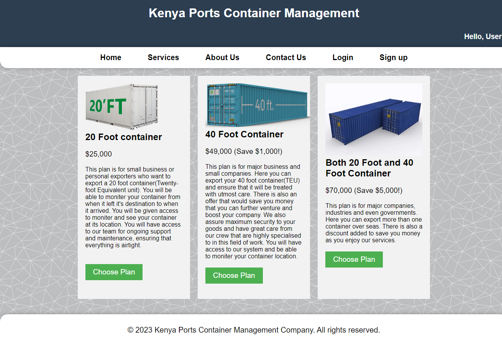

<h1>Container_Packing_Website</h1>
<h2>This is a website that generates slots for your container on to a ship. It will then track it overseas</h2>

<b>
Services offered
</b>

The above folder named leaflet contains java code to import a map of the world into your website.
That is it. I think i have uploaded all the necessary files.

When you want to run, 
<b>Do This</b>
1.  Download the entire Zip.
2.  All the contents of leaflet, drag them to the other part of the code
3.  You also need XAMMP to run the code. So have it and open port.
4.  Now when you run the php codes, it will be able to run.

Incase of any errors, please notify me and ill see what I can do. 

Happy Hunting or Coding :) 
